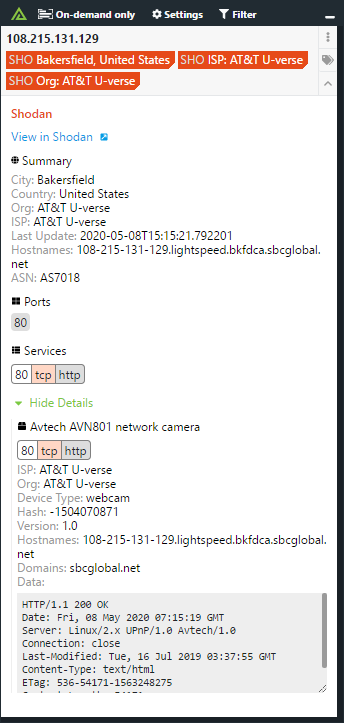

# Polarity Shodan Integration

Polarity's Shodan integration gives users access to automated IPv4 and IPv6 lookups against the Shodan Host REST API.  The Shodan REST API restricts searches to 1 per second.  The integration will automatically throttle lookups to stay below this limit and will queue up to 15 search requests per API key.  If the queue is full, you will receive back a response indicating that the queue is full and will have the option to rerun the search from the Overlay Window.  

You must be using a paid Shodan Membership API key. 

Please see [https://www.shodan.io/](https://www.shodan.io/) for more information.

|   |
|---|
|*Shodan Example* |

## Shodan Integration Options

### Shodan API Key

Your Shodan API Key.  This must be a paid membership API key.

## Installation Instructions

Installation instructions for integrations are provided on the [PolarityIO GitHub Page](https://polarityio.github.io/).

## Polarity

Polarity is a memory-augmentation platform that improves and accelerates analyst decision making.  For more information about the Polarity platform please see:

https://polarity.io/
